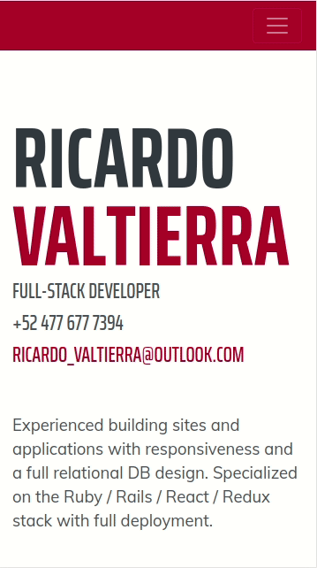

# Personal Portfolio

> Microverse ES6 Project

<p align="right">
  <br>
  <a href="https://github.com/ricardovaltierra/ricardovaltierra.github.io">Explore the repo »</a>
  <br>
  <a href="https://github.com/ricardovaltierra/ricardovaltierra.github.io/issues">Request Feature</a>
</p>

## Table of Contents

* [About the Project](#about-the-project)

* [Preview](#preview)

* [Built With](#built-with)

* [Getting Started](#getting-started)

* [How it Works](#how-it-works)

* [Contributing](#contributing)

* [Contact](#contact)

* [MIT License](#mit-license)

* [Creative Commons License](#creative-commons-license)


## About The Project

Restaurant page tribute page project for the application of ES6 and Webpack 4 with modularized code;

## Preview

 

> [Live Version!](https://raw.githack.com/ricardovaltierra/restaurant-page/page-design/dist/index.html#)

### Built With

* [HTML5](https://developer.mozilla.org/es/docs/HTML/HTML5)

* [CSS](https://developer.mozilla.org/en-US/docs/Web/CSS)

* [JS](https://www.javascript.com/)

## Getting Started

To get a local copy up and running follow these simple steps.

Clone or fork the <a href="https://github.com/ricardovaltierra/ricardovaltierra.github.io">repo</a> [git@github.com:ricardovaltierra/ricardovaltierra.github.io.git]

*note you need have install npm or yarn
* [npm](https://www.npmjs.com/get-npm)
* [yarn](https://classic.yarnpkg.com/en/docs/install)

### Running the code

*   Navigate to the root directory of the project

*   Run this command on your terminal to add all the required packages and dependencies
    ```
    $ npm install
    ```
*   If you're onto make some code edition you can 'watch' the live changes as follows
    ```
    $ npm run start
    ```    
   
## Contributing

Contributions are what make the open source community such an amazing place to be learn, inspire, and create. Any contributions you make are **greatly appreciated**.

1. Fork the Project

2. Create your Feature Branch (`git checkout -b feature/AmazingFeature`)

3. Commit your Changes (`git commit -m 'Add some AmazingFeature'`)

4. Push to the Branch (`git push origin feature/AmazingFeature`)

5. Open a Pull Request

## Contact

Ricardo Valtierra - [@RicardoValtie15](https://twitter.com/RicardoValtie15) - ricardo_valtierra@outlook.com  - [linkedin.com/in/ricardovaltierra/](https://www.linkedin.com/in/ricardovaltierra/)

## MIT License

This project is under the [MIT](LICENSE) license.
